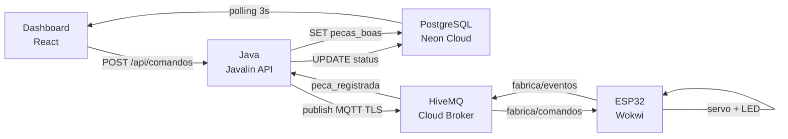

# WEG ERP System

Sistema de gestão industrial com integração em tempo real entre dashboard, API REST, banco de dados em nuvem e microcontrolador via MQTT. (https://wokwi.com/projects/457493494723068929)

---

## Arquitetura



---

## Stack

| Camada | Tecnologia |
|--------|-----------|
| Frontend | React 18 + Vite |
| Backend | Java 17 + Javalin 6 |
| Banco de dados | Neon PostgreSQL (serverless) |
| Mensageria | HiveMQ Cloud — MQTT TLS :8883 |
| Hardware | ESP32 simulado via Wokwi |

---

## Estrutura

```
WEG_ERP_System/
├── erp-dashboard/
│   ├── src/App.jsx            # Dashboard ERP + PLM completo
│   ├── vite.config.js         # Proxy /api → localhost:8080
│   └── package.json
└── backend/
    ├── src/main/java/erp/
    │   ├── Main.java
    │   ├── api/ApiServer.java      # Endpoints REST
    │   ├── database/DB.java        # Conexão PostgreSQL
    │   ├── mqtt/MqttService.java   # Publisher + Subscriber
    │   └── model/Evento.java
    ├── .env                        # Credenciais — nao commitar
    └── pom.xml
```

---

## Configuração

### Variáveis de ambiente

Crie `backend/.env`:

```env
DATABASE_URL=jdbc:postgresql://<host>/neondb?user=<user>&password=<senha>&sslmode=require
MQTT_BROKER=ssl://<cluster>.hivemq.cloud:8883
MQTT_USER=admin
MQTT_PASS=<senha>
```

### Banco de dados

Execute no SQL Editor do Neon:

```sql
CREATE TABLE usuarios (
  id SERIAL PRIMARY KEY,
  usuario VARCHAR(50) UNIQUE NOT NULL,
  senha VARCHAR(100) NOT NULL,
  nome VARCHAR(100) NOT NULL,
  perfil VARCHAR(50) NOT NULL,
  criado_em TIMESTAMPTZ DEFAULT now()
);

CREATE TABLE maquinas (
  id SERIAL PRIMARY KEY,
  codigo VARCHAR(20) UNIQUE NOT NULL,
  nome VARCHAR(100) NOT NULL,
  status VARCHAR(20) DEFAULT 'idle',
  temperatura INTEGER DEFAULT 0,
  meta_diaria INTEGER DEFAULT 20,
  pecas_boas INTEGER DEFAULT 0,
  atualizado_em TIMESTAMPTZ DEFAULT now(),
  ativa BOOLEAN DEFAULT true
);

CREATE TABLE produtos (
  id SERIAL PRIMARY KEY,
  codigo VARCHAR(20) UNIQUE NOT NULL,
  nome VARCHAR(100) NOT NULL,
  material VARCHAR(100),
  peso VARCHAR(50),
  tolerancia VARCHAR(50),
  responsavel VARCHAR(100),
  revisao VARCHAR(20)
);

CREATE TABLE ordens (
  id SERIAL PRIMARY KEY,
  produto VARCHAR(100) NOT NULL,
  quantidade INTEGER NOT NULL,
  maquina_cod VARCHAR(20) NOT NULL,
  prioridade VARCHAR(20) DEFAULT 'Normal',
  status VARCHAR(20) DEFAULT 'aberta',
  autor VARCHAR(100),
  criado_em TIMESTAMPTZ DEFAULT now()
);

CREATE TABLE producao (
  id SERIAL PRIMARY KEY,
  maquina_cod VARCHAR(20),
  ordem_id INTEGER,
  evento VARCHAR(50),
  pecas_boas INTEGER DEFAULT 0,
  temperatura INTEGER DEFAULT 0,
  autor VARCHAR(100),
  registrado_em TIMESTAMPTZ DEFAULT now()
);

CREATE TABLE estoque (
  id SERIAL PRIMARY KEY,
  produto VARCHAR(100) NOT NULL,
  quantidade INTEGER DEFAULT 0,
  minimo INTEGER DEFAULT 0,
  atualizado_em TIMESTAMPTZ DEFAULT now()
);

CREATE TABLE alertas (
  id SERIAL PRIMARY KEY,
  tipo VARCHAR(20),
  mensagem TEXT,
  maquina_cod VARCHAR(20),
  autor VARCHAR(100),
  resolvido BOOLEAN DEFAULT false,
  criado_em TIMESTAMPTZ DEFAULT now()
);

CREATE TABLE plm_fases (
  id SERIAL PRIMARY KEY,
  produto_cod VARCHAR(20),
  nome_fase VARCHAR(50),
  status VARCHAR(30) DEFAULT 'pendente',
  responsavel VARCHAR(100),
  observacao TEXT,
  data_conclusao DATE,
  alterado_por VARCHAR(100),
  atualizado_em TIMESTAMPTZ DEFAULT now()
);
```

---

## Como rodar

### Backend

```bash
cd backend
mvn clean package
set -a && source .env && set +a
java -jar target/erp-backend-1.0.jar
```

### Frontend

```bash
cd erp-dashboard
npm install
npm run dev
```

### ESP32 (Wokwi)

1. Acesse [wokwi.com](https://wokwi.com) e importe o `diagram.json`
2. No `sketch.ino`, configure `MQTT_BROKER` e `MQTT_PASS`
3. Clique em Play — aguarde `[ESP32] Sistema pronto.` no Serial Monitor

---

## API

| Método | Endpoint | Descricao |
|--------|----------|-----------|
| POST | `/api/login` | Autenticacao |
| GET | `/api/maquinas` | Lista maquinas ativas |
| GET | `/api/ordens` | Lista ordens |
| POST | `/api/ordens` | Cria ordem |
| POST | `/api/comandos` | Envia comando MQTT |
| GET | `/api/estoque` | Posicao do estoque |
| GET | `/api/alertas` | Ultimos 30 alertas |
| GET | `/api/plm` | Produtos e fases PLM |
| PATCH | `/api/plm/fase/:id` | Atualiza fase |

---

## Topicos MQTT

| Topico | Direcao | Conteudo |
|--------|---------|----------|
| `fabrica/comandos` | Java → ESP32 | `{"maquina_id","comando","autor"}` |
| `fabrica/eventos` | ESP32 → Java | `{"maquina_id","evento","pecas_boas","temperatura"}` |

Eventos possíveis: `iniciada`, `pausada`, `encerrada`, `peca_registrada`

---

## Usuarios de demonstracao

| Usuario | Senha | Nome | Perfil |
|---------|-------|------|--------|
| `admin` | `1234` | Ryhan Schutz | Gestor |
| `eng` | `1234` | Jhulia Reichardt | Engenheira |
| `op1` | `1234` | Brian Fachini | Operador |

---

## Conceito

> Lead Time e o tempo total entre a criacao de uma ordem e a entrega do produto.

A integracao ERP → MQTT → ESP32 elimina etapas manuais:

```
Sem integracao:  ordem → papel → supervisor → operador → maquina   (minutos / horas)
Com integracao:  ordem → MQTT → ESP32 → maquina                    (milissegundos)
```

---

Grupo 1 — Gestao Corporativa (ERP e PLM) · Tecnico em Cibersistemas para Automacao
